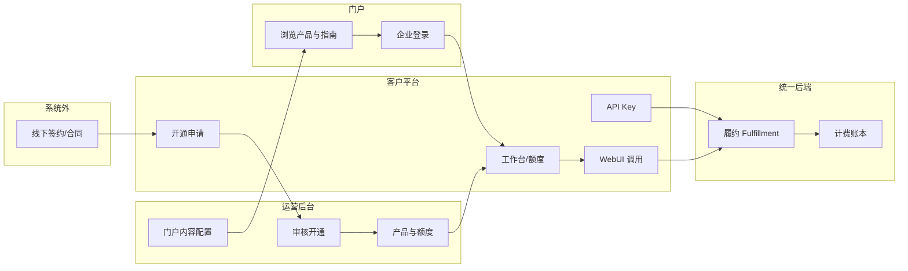
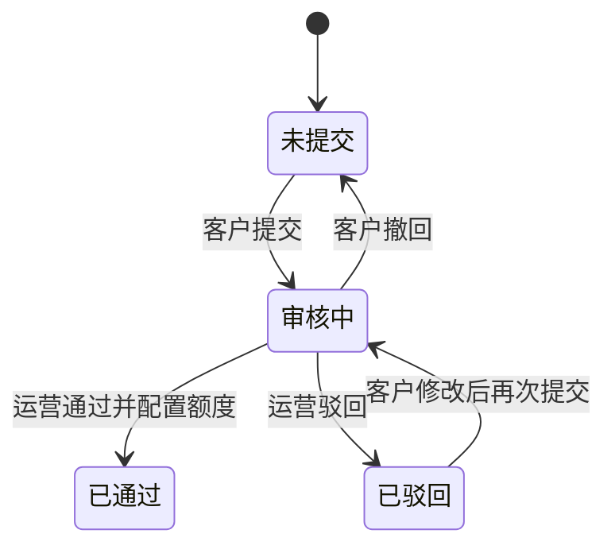
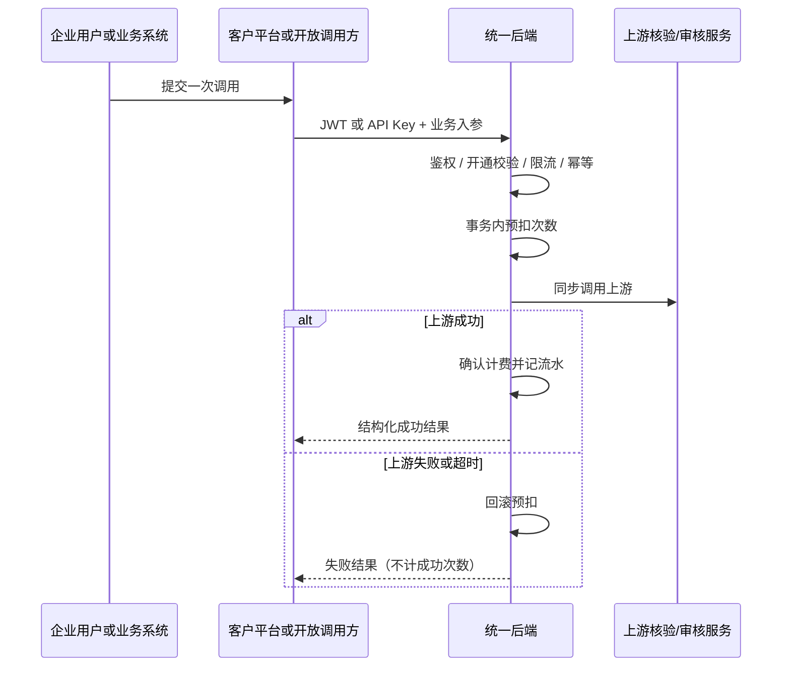
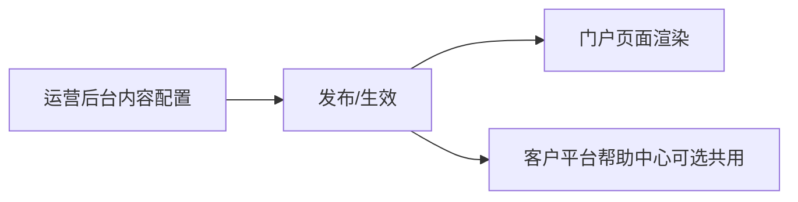
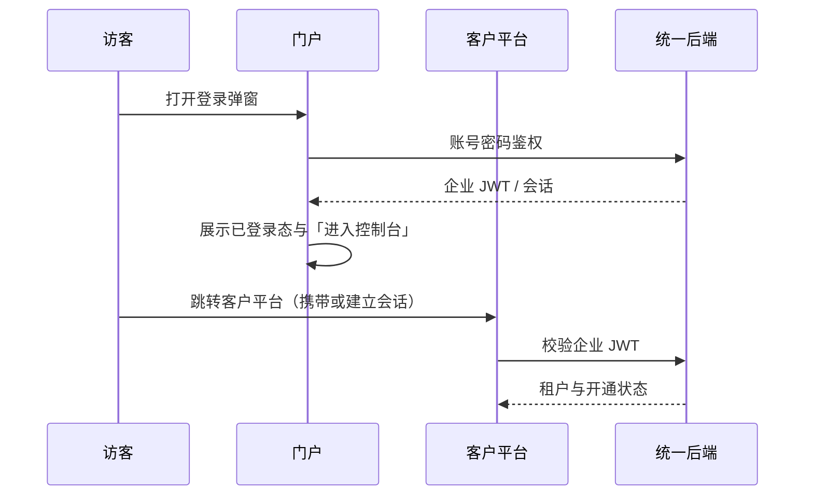

# 平台间业务流程（总章）

> 本文档描述 **DCI®技术服务中心** 三个前端平台与统一后端之间的业务闭环与协作关系。  
> 各平台页面级需求见：`PRD-01-门户.md`、`PRD-02-客户平台.md`、`PRD-03-运营后台.md`。  
> 本总章只写跨平台流程与依赖，不展开单页 UI 细则。

---

## 1. 产品与平台总览

### 1.1 产品定位

面向内容平台与版权机构，售卖 **6 个 API 产品**（按调用次数计量）。其中 **3 个产品**额外提供客户平台 WebUI（同步提交、同步展示结果）。WebUI 与开放 API 必须走同一套履约与计费路径。

### 1.2 六个产品

| 品类 | 产品 | 能力摘要 | 客户平台 WebUI |
|------|------|----------|----------------|
| 版权核验 | DCI核验 | 核验 DCI 码是否存在及与作品、著作权人是否一致 | 有 |
| 版权核验 | 版权登记信息核验 | 核验登记号是否存在、登记类型及与名称/著作权人是否一致 | 有 |
| 版权核验 | 版权登记证书核验 | 上传证书文件/图片进行验真 | 有 |
| 智能辅助审核 | 内容安全审核 | 对登记申请材料做内容安全风险判定参考 | 有 |
| 智能辅助审核 | 作品登记查重 | 与已登记样本比对，识别高度雷同 | 有 |
| 智能辅助审核 | 疑似侵权审核 | 肖像/人声、知名人物/商标/作品等疑似侵权识别 | 有 |

另：门户侧还对外宣传 **数据统计分析**（行业专题/年报/月报及订阅咨询），该能力以报告订阅与线下对接为主，不计入上述 6 个按次计费 API 产品清单。

### 1.3 三个平台与使用者

| 平台 | 使用者 | 职责 |
|------|--------|------|
| **门户**（Portal） | 访客、已登录企业用户 | 品牌与产品介绍、接入说明、FAQ、登录入口、跳转客户平台 |
| **客户平台**（Customer） | 已开通企业用户 | 开通申请、工作台、产品 WebUI 调用、API Key、账号与文档 |
| **运营后台**（Ops） | 内部运营人员 | 开通审核、客户与额度、产品上架、统计、门户内容与系统管理 |

统一后端（目标）：NestJS 管理面 `/api/v1/*` + 开放面 `/open/v1/{productCode}/*`；鉴权区分企业 JWT、运营 JWT、开放 API Key。

---

## 2. 角色与凭证

| 角色 | 登录入口 | 凭证类型 | 可到达的系统 |
|------|----------|----------|--------------|
| 访客 | 门户（未登录） | 无 | 仅门户公开页 |
| 企业账号 | 门户登录弹窗 → 客户平台 | 企业用户 JWT | 门户（登录态）+ 客户平台 |
| 运营账号 | 运营后台登录 | 运营用户 JWT | 仅运营后台 |
| 客户业务系统 | 开放 API | API Key | `/open/v1/{product}/*` |

说明：

- 企业账号由运营开通（或开通审核通过后生效），门户登录成功后可进入客户平台。
- 开放 API Key 在客户平台创建与管理，调用时按租户已开通产品与剩余额度校验。

---

## 3. 关键业务闭环

### 3.1 总览（文字）

1. 商务线下洽谈、合同生效（系统外或合同信息录入系统）。  
2. 企业用户在客户平台提交开通申请（或运营侧创建客户账号）。  
3. 运营在后台审核开通：确认企业信息、开通产品、录入额度/有效期等。  
4. 企业用户登录客户平台：查看额度、管理 API Key、用 WebUI/API 调用产品。  
5. 每次成功调用扣减约定次数，写入流水与账本；未开通或额度不足则拒绝。  
6. 续费、加额度、停用产品由运营按合同在后台操作。  
7. 门户展示内容、帮助/FAQ/接入指南可由运营后台配置后对访客可见。

### 3.2 总览（流程示意）

---

## 4. 闭环一：客户开通与审核

### 4.1 业务目标

将「线下签约后的企业」转变为系统内可登录、可调用产品的租户：完成企业主体信息采集、合同材料关联、产品开通意向、运营审核与额度生效。

### 4.2 参与方

| 步骤 | 平台 | 角色 | 动作 |
|------|------|------|------|
| 提交申请 | 客户平台 | 企业账号（待开通或可登录态） | 填写企业与合同信息、选择意向产品、上传合同附件并提交 |
| 审核处理 | 运营后台 | 运营人员 | 查看申请、通过/驳回；通过时配置产品服务与额度 |
| 生效使用 | 客户平台 | 企业账号 | 解锁控制台，进入工作台与产品页 |

### 4.3 状态迁移（开通申请）

| 状态 | 含义 | 客户平台可见行为 | 运营后台可见行为 |
|------|------|------------------|------------------|
| 未提交 | 尚未正式提交 | 可编辑并提交 | 无对应有效申请或仅草稿 |
| 审核中 | 已提交待审 | 只读查看；可发起撤回（若业务允许） | 可审核通过/驳回 |
| 已通过 | 开通生效 | 进入工作台；按已开通产品使用 | 可继续调整产品服务/额度 |
| 已驳回 | 审核未通过 | 可见驳回原因；可修改后再次提交 | 保留审核记录 |

### 4.4 数据协同要点

- 申请单需包含：企业名称、统一社会信用代码、联系人、登录账号意向、合同起止、意向产品清单、合同附件等（字段细则见客户平台 / 运营后台对应页）。
- 审核通过时，运营侧写入：租户、登录账号、已开通产品、额度类型（总量/周期等）、有效期、是否停用等。
- 通过后客户平台以「租户权益」为准展示可调用产品与剩余次数。

---

## 5. 闭环二：产品调用、履约与计费

### 5.1 业务目标

保证 **WebUI 与开放 API 同一履约路径**：鉴权 → 是否开通 → 限流 → 幂等 → 预扣次数 → 调用上游 → 成功确认计费 / 失败回滚 → 返回结果；余额与流水可对账。

### 5.2 调用入口对照

| 入口 | 平台/通道 | 鉴权 | 路径形态（目标） |
|------|-----------|------|------------------|
| 页面提交 | 客户平台 WebUI | 企业 JWT | `/api/v1/products/{code}/invoke`（或等价） |
| 系统对接 | 客户业务系统 | API Key | `/open/v1/{productCode}/...` |

两者均转入同一 `Fulfillment`。

### 5.3 同步调用链

### 5.4 计费与额度原则

| 原则 | 说明 |
|------|------|
| 按次计量 | 仅对约定成功调用扣次 |
| 账本不可裸改 | 剩余次数变更必须有账本分录（开通赠送、调用扣减、运营调账等） |
| 拒绝条件 | 产品未开通、已停用、过期、额度不足、鉴权失败 |
| 超时 | 同步超时视为失败，不得记成功计费 |

### 5.5 运营侧协同

运营后台负责：产品上下架与页面/API 开关、客户产品服务配置、额度调整、使用统计与对账查询。客户平台只读展示本租户额度与调用结果，不提供自助开通或自助加额度。

---

## 6. 闭环三：门户内容与运营配置

### 6.1 业务目标

门户对访客展示的首页焦点、产品介绍、帮助文章、FAQ 等，由运营后台维护，保证对外文案与对内配置一致、可审计。

### 6.2 内容流向

| 内容类型 | 配置端（运营后台） | 消费端（门户） |
|----------|--------------------|----------------|
| 门户首页焦点/区块 | 门户内容管理 | 首页 Hero、产品展示等 |
| 帮助中心文章目录 | 帮助中心管理 | 接入指南等树形文档（及客户平台帮助若共用） |
| FAQ | FAQ 管理 | 门户常见问题 |
| 联系信息 | 系统或内容配置 | 页脚、加入合作弹窗、联系页 |

### 6.3 依赖说明

- 门户页面结构与导航以门户 PRD 为准；具体文案字段以运营配置数据为准。  
- 未配置或下架的内容，门户侧按「隐藏该区块 / 展示空态」策略处理（细则在对应平台页补充）。

---

## 7. 闭环四：登录、会话与跨站跳转

### 7.1 企业用户路径

### 7.2 规则摘要

| 规则 | 说明 |
|------|------|
| 门户登录 | 使用企业账号；成功后门户展示登录态 |
| 进入客户平台 | 已登录用户可通过门户入口进入客户平台；客户平台按开通状态决定落在「开通申请」或「工作台」 |
| 忘记密码 | 门户提供站内找回流程；找回成功后可用新密码登录 |
| 运营登录 | 与企业账号体系隔离，不可混用门户/客户平台账号登录运营后台 |
| 登出 | 清除对应端会话；跨站是否同步登出在实现阶段约定（目标：企业侧门户与客户平台会话策略一致） |

独立静态页 `login.html` **不在本 PRD 系列范围内**。

---

## 8. 平台依赖关系矩阵

| 能力 | 门户 | 客户平台 | 运营后台 | 统一后端 |
|------|------|----------|----------|----------|
| 产品介绍与获客 | 主责 | — | 配置文案 | 内容接口 |
| 企业登录 | 入口 | 使用会话 | — | Identity |
| 开通申请 | 引导 | 主责提交 | 主责审核 | Access |
| 产品额度 | 说明性文案 | 展示与消耗 | 配置与调账 | Entitlement / Billing |
| WebUI 调用 | — | 主责 | 开关/统计 | Fulfillment |
| 开放 API | 文档引导 | Key 管理 + 文档 | 接口目录配置 | Open API |
| 使用统计 | 行业报告介绍 | 本租户概览 | 运营统计 | 流水聚合 |
| 帮助/FAQ | 展示 | 展示（可共用） | 维护 | 内容 |

---

## 9. 与各平台文档的衔接

| 文档 | 本总章引用关系 |
|------|----------------|
| `PRD-01-门户.md` | 展开访客浏览、登录、内容展示；依赖闭环三、四 |
| `PRD-02-客户平台.md` | 展开开通申请、工作台、六产品 WebUI、Key、账号；依赖闭环一、二、四 |
| `PRD-03-运营后台.md` | 展开审核、客户与产品、统计、内容与系统管理；依赖闭环一、二、三 |

后续在各平台文档开头「相关平台与依赖」中，仅保留对本总章对应闭环的短述与链接，避免重复展开全链路。

---

## 10. 修订记录

| 版本 | 日期 | 说明 |
|------|------|------|
| 0.1 | 2026-08-29 | 首版：平台间四大闭环与依赖矩阵（C3 阶段配套总章） |
