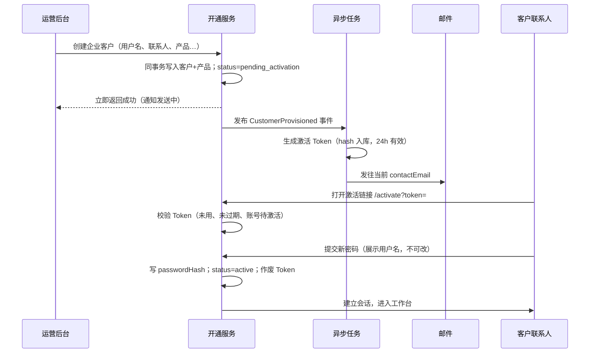

# 企业客户账号开通与激活流程

> 版本：v1.0  
> 适用范围：DCI®技术服务中心（客户控制台）+ 运营后台  
> 关联规范：[ADR 003 线下签约](../specifications/code_specification/adr/003-offline-onboarding.md)、[06 安全与权限](../specifications/code_specification/06-security.md)

---

## 1. 背景与目标

本系统采用 **线下签约、运营开通** 模式（见 ADR 003）：客户在门户留资后，由运营人员在后台创建企业客户账号并配置产品服务，客户再通过控制台登录并使用产品。

本文沉淀 **「运营开通 → 客户激活 → 日常使用」** 的身份与安全流程设计，用于指导前后端实现与后续扩展。

设计目标：

- **简单**：首期不做强制 2FA、不发临时密码、不引入短信双通道
- **安全**：敏感操作必须验证 **当前可信联系人邮箱**；激活链接一次性、有时效
- **贴合 B2B**：账号归属 **企业**，联系人可变更；**用户名** 作为稳定登录标识，**邮箱** 作为当前可信联系人的身份校验通道

---

## 2. 身份模型

### 2.1 两个标识，职责分离

| 标识 | 字段（现有/建议） | 约束 | 用途 |
|------|-------------------|------|------|
| **用户名** | `account` | **全局唯一**；字母开头，6–20 位 | **登录名**；创建后原则上不可改 |
| **联系人绑定邮箱** | `contactEmail` | 非全局唯一（不同企业可 coincidentally 相同需谨慎，见注） | **身份校验**（激活、改密、找回密码）；发通知 |

> **注**：`contactEmail` 在业务上按「当前企业客户的可信联系人邮箱」处理，系统 **不以邮箱作为登录名**。若未来需防止跨租户邮箱冲突，可在业务层限制「同一邮箱不能同时作为多个 **active** 企业的唯一激活联系人」，此为可选增强，首期可不实施。

### 2.2 企业、账号、联系人

```
企业客户（Tenant / CustomerAccount）
├── 企业信息（只读为主）：公司全称、信用代码、法人等
├── 登录用户名 account（全局唯一，稳定标识）
├── 当前联系人 contactName / contactPhone / contactEmail（可变更，变更后即为新的「可信联系人」）
├── 账号状态 status
└── 产品服务 productServices[]
```

要点：

- **账号代表企业**，不是代表某个自然人；自然人通过 **当前登记的联系人** 与企业账号关联。
- 运营侧或客户侧更新联系人信息后，**以数据库中当前记录为准**，后续所有邮箱验证码、激活通知均发往 **当前 `contactEmail`**。
- 联系人变更属于 **高敏感操作**，须记审计日志；变更后应使旧的未使用激活 Token 失效。

### 2.3 邮箱「被认可为用户身份」的含义

在本系统中，「邮箱作为认可的用户身份」**不等于**「用邮箱登录」，而是：

1. **开通/激活**：向当前 `contactEmail` 发送一次性激活链接，证明运营录入的联系人渠道可达。
2. **改密 / 找回密码**：在掌握 **用户名 + 旧密码**（或忘记密码流程）的前提下，向 **当前 `contactEmail`** 发送验证码，作为第二道校验。
3. **运营兜底**：重发激活、重置密码等通知，均发往 **当前 `contactEmail`**。

因此：**谁持有当前联系人邮箱，谁就能完成上述敏感操作**——这与 B2B「企业授权联系人操作账号」的假设一致。

---

## 3. 与通用 B2B 开通方案的对照

参考的「临时密码 + 强制 2FA + 双通道通知 + 邮箱登录」方案，在本系统中的裁剪结论如下：

| 参考方案 | 本系统决策 | 原因 |
|----------|------------|------|
| 邮箱/手机作为登录名 | **否**；登录名固定为 **用户名** | 企业可换联系人，登录标识需稳定 |
| 邮件发送临时密码 | **否** | 增加泄露面；与「链接激活 + 自设密码」重复 |
| 一次性激活链接 | **是** | 简单、安全，证明邮箱可达 |
| 强制 2FA（TOTP/短信） | **二期** | 首期用「邮箱验证码」覆盖改密等场景 |
| 事件驱动异步发信 | **是** | 开通接口快速返回，发信可重试 |
| 多成员与内置角色 | **二期** | 当前一个 enterprise 账号对应一个管理员入口 |

---

## 4. 账号状态

在现有 `enabled | disabled` 基础上扩展：

| 状态 | 含义 | 允许的操作 |
|------|------|------------|
| `pending_activation` | 待激活 | 仅激活流程（校验 Token、设置密码） |
| `active` | 正常 | 登录及全部已授权业务 |
| `disabled` | 停用 | 运营停用；拒绝登录，作废会话 |

状态迁移：

```
pending_activation ──激活成功──▶ active
active ──运营停用──▶ disabled
disabled ──运营启用──▶ active（若从未激活则仍须走激活）
pending_activation ──运营停用──▶ disabled
```

---

## 5. 开通与激活流程

### 5.1 整体时序



### 5.2 运营开通（同步）

运营在后台创建客户时必填：

- **用户名** `account`（全局唯一，创建后不可编辑）
- 企业信息、合同与 **产品服务配置**
- **当前联系人**：姓名、电话、**绑定邮箱** `contactEmail`

创建规则：

- 同一事务内完成：客户主表 + 产品服务（+ 合同，如有）
- 初始 `status = pending_activation`
- **不写入可用密码**（或写入不可解析的占位 hash）
- 接口 **同步返回**，不等待邮件发送

### 5.3 异步激活通知

触发：`CustomerProvisioned` 事件（消息队列或 `outbox` + 异步消费者均可）。

消费者动作：

1. 读取该客户 **当前** `contactEmail`、`contactName`、`account`
2. 生成随机 Token（≥32 字节），库中仅存 **hash**
3. 设置 `activationExpiresAt = now + 24h`
4. 发送邮件，内容包含：
   - 控制台登录地址
   - **用户名**（明确写出，避免客户误以为用邮箱登录）
   - **激活链接**（一次性）
   - 有效期与安全提醒（勿转发）

**不发临时密码。**

发信限流（与改密一致）：

- 同一邮箱 **60 秒内 1 次**
- 同一邮箱 **每天最多 10 次**

失败处理：自动重试 3 次 → 仍失败则标记 `notification_status = failed`，运营后台可 **手动重发**。

### 5.4 客户激活（同步）

路由示例：`GET /activate?token=` → 展示页；`POST /auth/activate`。

**步骤 1 — 校验 Token**

- Token 有效、未使用、未过期
- 对应账号 `status = pending_activation`
- 失败：提示链接无效或过期，引导联系运营重发

**步骤 2 — 设置密码**

- 页面展示：**用户名（只读）**、企业名称、脱敏联系人邮箱
- 用户输入新密码 + 确认（强度规则与运营侧一致）
- 提交后：`passwordHash` 入库，`status = active`，`activatedAt = now`
- **立即作废**激活 Token
- 创建会话（JWT，`aud=tenant`，`sub=account`）
- 审计：记录「账号激活成功」

> 激活阶段 **不再额外发邮箱验证码**：一次性链接已证明 **当前联系人邮箱** 可达。若安全等级需提高，可在设密前增加 6 位邮箱验证码（复用改密发码逻辑），作为可选增强。

---

## 6. 登录与日常安全

### 6.1 登录

- **登录名**：用户名 `account`
- **密码**：用户激活时自设 / 后续修改的密码
- 校验：`status = active` 且密码正确
- 登录接口限流：按 IP + 用户名防爆破（见 06-security）

### 6.2 修改密码（已实现方向）

适用于 **已激活** 账号，三步：

1. 验证 **当前密码**
2. 向 **当前 `contactEmail`** 发送验证码并校验
3. 设置新密码；成功后 **作废其他设备会话**，仅保留当前会话

### 6.3 忘记密码

适用于 **已激活** 账号：

1. 输入 **用户名**
2. 向该账号 **当前 `contactEmail`** 发送验证码（界面脱敏展示，不暴露完整邮箱）
3. 验证码通过后设置新密码
4. 作废全部会话

### 6.4 敏感操作与邮箱的关系（小结）

| 操作 | 用户名 | 当前联系人邮箱 |
|------|--------|----------------|
| 日常登录 | 必填 | 不使用 |
| 首次激活 | 链接绑定 | 链接发往该邮箱 |
| 修改密码 | 已登录 | 验证码 |
| 忘记密码 | 必填 | 验证码 |
| 运营重发激活 | — | 发往当前邮箱 |

---

## 7. 联系人及绑定邮箱变更

企业更换联系人是正常业务，但必须保证 **「当前记录 = 当前可信」** 原则。

### 7.1 运营后台变更（主路径）

运营在 **编辑客户** 中修改 `contactName` / `contactPhone` / `contactEmail`：

- 须记 **审计日志**（变更前后对比）
- 若 `contactEmail` 变更：
  - **作废** 未使用的激活 Token
  - 若账号仍为 `pending_activation`：自动 **重发激活邮件** 至新邮箱（或提示运营手动重发）
  - 若账号已为 `active`：**不自动改密**；新邮箱从下一次敏感操作起生效

### 7.2 客户控制台变更（可选，二期）

若允许客户在「账号中心」自助修改联系信息：

- 修改 **电话/地址**：登录态下可直接改或轻量校验
- 修改 **绑定邮箱**：建议 **旧邮箱验证码 + 新邮箱验证码** 双确认；或仅允许运营改

首期建议：**联系人邮箱仅运营可改**，与客户信息编辑权限一致，实现成本更低。

### 7.3 变更后的信任边界

- 系统 **永远信任当前库内** 的 `contactName` + `contactEmail`
- 不向用户展示「历史联系人邮箱」作为校验目标
- 运营误改邮箱的风险通过 **审计 + 重发激活/人工核对** 控制

---

## 8. 异常处理与运营兜底

| 场景 | 处理方式 |
|------|----------|
| 创建成功但发信失败 | 重试 3 次；失败标记，运营 **重发激活邮件** |
| 24h 内未激活 | 可选：发送提醒；Token 过期后须运营重发 |
| 激活链接重复使用 | 拒绝，提示已激活或链接失效 |
| 联系人邮箱填错（未激活） | 运营修改邮箱并重发激活 |
| 联系人邮箱填错（已激活） | 运营修改邮箱并审计；客户用 **用户名 + 旧密码** 登录不受影响；后续改密验证码发往新邮箱 |
| 开通事务 halfway 失败 | 整单回滚，不留半成品客户 |
| 账号被盗疑义 | 运营 **停用** 账号 + 强制会话失效 |

运营后台能力清单（建议）：

- 创建客户（`pending_activation`）
- **重发激活邮件**（作废旧 Token，生成新 Token）
- 编辑联系人 / 邮箱
- 启用 / 停用账号
- 重置密码（可选：仅触发「忘记密码」邮件至当前邮箱，不生成明文密码）

---

## 9. 建议数据字段

在现有 `CustomerAccount` 上扩展：

```text
account                 VARCHAR  UNIQUE NOT NULL   -- 登录用户名
contactName             VARCHAR  NOT NULL
contactPhone            VARCHAR  NOT NULL
contactEmail            VARCHAR  NOT NULL           -- 当前可信绑定邮箱（非登录名）
status                  ENUM('pending_activation','active','disabled')
passwordHash            VARCHAR  NULL              -- 激活前为空
activatedAt             DATETIME NULL

activationTokenHash     VARCHAR  NULL
activationExpiresAt     DATETIME NULL
activationSentAt          DATETIME NULL
notificationStatus      ENUM('pending','sent','failed') NULL

-- 发信限流可放 Redis；或 email_send_log 表按邮箱+日统计
```

索引建议：

- `UNIQUE(account)`
- `INDEX(status, activationExpiresAt)` 供定时任务清理过期 Token

---

## 10. 接口清单（建议）

| 方法 | 路径 | 说明 |
|------|------|------|
| POST | `/api/v1/ops/customers` | 运营创建客户 → `pending_activation` + 异步发信 |
| POST | `/api/v1/ops/customers/:id/resend-activation` | 重发激活邮件 |
| GET | `/api/v1/auth/activate/verify` | 校验 Token，返回用户名、企业名、脱敏邮箱 |
| POST | `/api/v1/auth/activate` | Token + 新密码 → `active` + 登录 |
| POST | `/api/v1/auth/login` | 用户名 + 密码 |
| POST | `/api/v1/auth/password/change` | 旧密码 + 邮箱验证码 + 新密码 |
| POST | `/api/v1/auth/password/forgot` | 用户名 → 发验证码 |
| POST | `/api/v1/auth/password/reset` | 用户名 + 验证码 + 新密码 |

---

## 11. 与现有实现的关系

| 模块 | 现状 | 后续 |
|------|------|------|
| 运营创建客户 | 同步创建，`status=enabled`，含 `passwordHint` 演示 | 改为 `pending_activation`，取消初始明文密码 |
| 客户登录 | 演示环境未接真实登录 | 用户名 + 密码，校验 `active` |
| 修改密码页 | 已实现：旧密码 + 邮箱验证码 | `contactEmail` 作为发码目标，与本文一致 |
| 门户忘记密码 | 演示：邮箱 + 验证码 | 改为 **用户名** 查账号，向 **当前 contactEmail** 发码 |
| 安全规范 06 | JWT 分域、密码哈希、审计 | 激活/改密/重发均记审计 |

---

## 12. 分期建议

### 第一期（MVP）

- 用户名全局唯一登录
- `pending_activation` + 邮件激活链接 + 自设密码
- 运营重发激活、编辑联系人邮箱
- 改密：旧密码 + 当前联系人邮箱验证码
- 忘记密码：用户名 + 当前联系人邮箱验证码

### 第二期（增强）

- 客户自助改邮箱（双邮箱验证）
- 激活/登录可选 TOTP 2FA
- 同一联系人邮箱跨企业冲突策略
- Outbox + MQ 正式化异步发信

---

## 13. 设计结论（摘要）

1. **用户名** 是企业账号在系统中的 **唯一、稳定登录标识**，不随联系人变更而改变。  
2. **联系人绑定邮箱** 是企业当前 **可信联系渠道**，用于激活、改密、找回密码等 **身份校验**，**不作为登录名**。  
3. 开通流程采用 **异步发激活链接 + 客户自设密码**，不发临时密码，首期不做强制 2FA。  
4. 联系人/邮箱变更后，**以最新记录为准**，须审计并作废旧激活 Token，必要时重发激活邮件。  

该方案在保持 B2B 灵活性的同时，与现有 ADR 003、安全规范及控制台改密能力保持一致，实现路径清晰、可分期落地。
