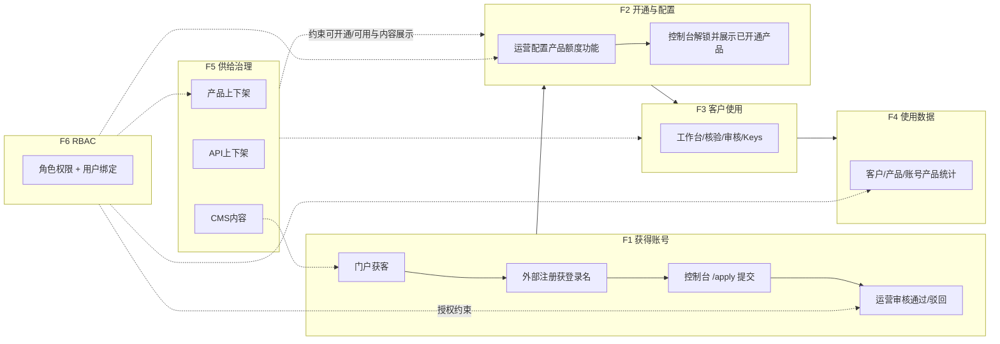
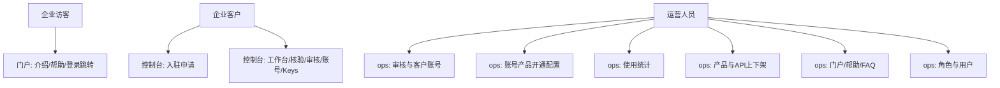

# DCI® 技术服务中心 — 业务流程图 · 文生图提示词

> 用途：粘贴到文生图 / 流程图生成模型，或作为人工制图说明书。  
> 目标：把「外部角色 × 平台 × 模块 × 功能 × 业务结果」串成可读的业务流。  
> 依据：仓库三端 `portal` / `customer` / `ops` 当前业务设计（前端原型；Mock 边界见图注）。  
> 建议：先出「总览泳道图」，再用「分图 F1～F6」补细节；角色能力对照表可单独出一张信息图。

---

## 核心业务流编号（制图统一用此编号）

| 编号 | 业务主题 | 主责角色 | 主平台 |
|------|----------|----------|--------|
| **F1** | 客户获得账号（注册 + 入驻申请 + 审核通过） | 企业联系人、运营 | 外部注册 → customer → ops |
| **F2** | 为客户开通/管理账号内产品与功能 | 运营 | ops |
| **F3** | 客户使用产品 | 企业客户 | customer（+ portal 获知） |
| **F4** | 后台管理使用数据（运营统计） | 运营 | ops |
| **F5** | 产品上下架、API 上下架、CMS 内容管理 | 运营 | ops（内容影响 portal/customer） |
| **F6** | 用 RBAC 管理运营人员账号与权限 | 超管 / 有权限的运营 | ops |

> 说明：你原文中两项都标成「5」，制图时把「产品/API/CMS」定为 **F5**，把「RBAC」定为 **F6**，避免混线。

---

## 一、角色 × 平台 × 模块 × 功能 × 业务（制图必须遵守）

生成任何业务流图前，模型必须按下列映射落字，不得张冠李戴。 

### 角色 R1 · 企业访客 / 潜在客户联系人

| 平台 | 模块/入口 | 功能 | 实现的业务 |
|------|-----------|------|------------|
| 门户 portal | 首页 | 浏览产品介绍、合作流程 | 了解平台能力，产生合作意向 |
| 门户 portal | 帮助中心 / FAQ | 查阅指南与常见问题 | 自助了解使用方式 |
| 门户 portal | 联系我们 / 法务页 | 查看联系与协议信息 | 评估合作合规信息 |
| 门户 portal | 登录入口 | 模拟登录后跳转控制台 | 进入客户侧入口（无 SSO，仅跳转） |

### 角色 R2 · 企业客户账号使用者（已注册企业）

| 平台 | 模块/入口 | 功能 | 实现的业务 |
|------|-----------|------|------------|
| 客户控制台 customer | `/apply` 入驻申请（未开通锁定页） | 填企业/合同/附件；提交；待审撤回（保留草稿）；驳回查看原因并重提 | **F1** 完成入驻申请闭环 |
| 客户控制台 customer | 工作台 `/desk` | 查看已开通产品与用量概览 | 掌握本企业服务状态 |
| 客户控制台 customer | 版权核验 | DCI / 信息 / 证书核验（Web） | **F3** 使用核验类产品 |
| 客户控制台 customer | 智能辅助审核 | 内容安全 / 查重 / 疑似侵权 | **F3** 使用审核类产品 |
| 客户控制台 customer | 账号中心 / 改密 | 维护机构联系信息、修改密码 | 账号自助维护 |
| 客户控制台 customer | API Keys / API 文档 | 管理调用密钥、查阅接口说明 | **F3** 走 API 集成使用（目标态） |
| 客户控制台 customer | 帮助中心（控制台内） | 查阅帮助 | 使用期自助支持 |

### 角色 R3 · 平台运营人员（受 RBAC 约束）

| 平台 | 模块/入口 | 功能 | 实现的业务 |
|------|-----------|------|------------|
| 运营后台 ops | 客户账号管理 | 审核入驻申请（通过/驳回）、查看申请详情 | **F1** 放行或驳回客户 |
| 运营后台 ops | 客户账号列表 / 详情 / 编辑 | 新增或维护企业账号、启停用、合同信息 | **F2** 账号生命周期 |
| 运营后台 ops | 客户产品服务配置 | 为账号开通产品、配额度/参数/有效期、调整已开通功能 | **F2** 产品与功能开通管理 |
| 运营后台 ops | 运营统计（客户/产品/账号×产品） | 查看调用与活跃等统计 | **F4** 使用数据运营 |
| 运营后台 ops | 版权核验产品 / 智能审核产品 | 产品上架、WebUI/能力开关与参数 | **F5** 产品上下架与能力治理 |
| 运营后台 ops | 接口服务设置 | API 目录维护、接口上下架/可见性 | **F5** API 上下架治理 |
| 运营后台 ops | 门户内容 / 帮助中心 / FAQ | CMS 编辑发布 | **F5** 内容运营（影响门户等） |
| 运营后台 ops | 角色权限 | 配置角色与权限树（页面/按钮级） | **F6** 权限模型 |
| 运营后台 ops | 用户管理 | 创建运营账号、分配角色 | **F6** 运营账号管理 |
| 运营后台 ops | 操作日志 | 审计关键操作 | 合规追溯 |
| 运营后台 ops | 首页仪表盘 | 总览指标与快捷入口（按权限过滤） | 日常运营入口 |

### 角色 R4 · 外部账号注册体系（系统角色，非人）

| 平台 | 模块 | 功能 | 实现的业务 |
|------|------|------|------------|
| 外部系统（图外） | 注册 | 发放登录用户名 | **F1** 前置：客户拿到可登录身份 |
| → 客户控制台 | 登录后进入 | 未开通则只能访问 `/apply` | 与入驻门禁衔接 |

---

## 二、总览提示词（一张总图 · 泳道业务流）

```text
请生成一张「DCI® 技术服务中心 · 端到端业务流程图（泳道图）」，简体中文，适合放进解决方案/产品说明书。其中，生成任何业务流图前，模型必须按参考图片中列出的知识卡来映射落字，不得张冠李戴。

【画风】
- 白底、扁平线框、无渐变、无 emoji、无 3D、无人物肖像
- 横向时间/阶段推进（左→右），纵向为泳道（上→下）
- 每个步骤框内必须写清：【角色】在【平台/模块】做【功能】→【业务结果】
- 阶段编号用 F1～F6，颜色浅区分即可，不要彩虹

【纵向泳道（从上到下固定顺序）】
1. 企业访客 / 企业客户
2. 外部注册体系
3. 客户控制台（customer）
4. 运营后台（ops）
5. 对外门户（portal）——可只在 F1 获客与 F5 内容生效处出现活动框

【横向阶段（从左到右，必须完整出现）】

▌F1 客户获得账号
- 门户：访客浏览介绍/帮助（获客）
- 外部注册：企业完成账号注册，获得登录名
- 控制台：登录后进入 /apply；填写企业与合同并提交申请；可撤回（保留草稿）或驳回后重提
- 运营：客户账号管理中审核申请（通过 / 填写驳回原因）
- 结果：通过则账号具备开通资格；未通过则仍锁定在申请页

▌F2 开通产品并管理账号内产品与功能
- 运营：在客户详情/产品服务配置中，为该企业开通产品、设置额度/有效期/附属参数、启停功能
- 也可维护账号启停用、合同信息
- 结果：控制台解锁后，工作台展示已开通产品；客户仅能使用已开通且上架的能力

▌F3 客户使用产品
- 控制台工作台查看配额与入口
- 版权核验三模块、智能审核三模块进行业务操作（Web；API Keys + API 文档支撑集成调用）
- 结果：产生调用/使用记录（供后续统计）

▌F4 后台管理使用数据
- 运营：客户使用统计、产品使用统计、账号×产品使用统计（矩阵/明细）
- 结果：掌握谁在用、用什么、用多少，支撑运营决策

▌F5 产品上下架 · API 上下架 · CMS
- 运营：产品上架管理（版权核验产品、智能审核产品）控制能力是否对客户可见/可用
- 运营：接口服务设置，管理 API 上下架与目录
- 运营：门户内容/帮助中心/FAQ 的 CMS 编辑
- 门户（及控制台帮助）：用户侧看到更新后的内容
- 结果：平台供给侧（产品、接口、内容）可运营治理

▌F6 RBAC 管理运营账号与权限
- 运营（通常超管）：角色权限中配置权限树（模块/页面/按钮）
- 用户管理中创建运营账号并绑定角色
- 结果：不同运营人员只能进入被授权的模块与功能；仪表盘快捷入口亦按权限过滤
- 用虚线框标注：F6 是横切能力，约束 F1/F2/F4/F5 中运营侧操作是否可执行

【连线规则】
- 实线：主业务顺序 F1→F2→F3→F4（F4 可与 F3 并行回流）
- F5 用旁路箭头指向「供给层」，并向下影响 F3 可用能力与门户内容
- F6 用横向虚线带覆盖运营泳道，标注「权限校验」
- 门户→控制台标注「URL 跳转，无 SSO」

【标题与图注】
- 标题：DCI® 技术服务中心 · 核心业务流程图
- 图注：角色—平台—模块—功能—业务结果已写入步骤框；当前实现为前端原型，跨端数据未真实打通

输出 16:9 或更宽的泳道总览图，文字可读。
```

---

## 三、精简总览（上下文不够时）

```text
画一张中文泳道业务流程图（白底扁平）：

泳道：企业客户｜外部注册｜客户控制台｜运营后台｜门户

阶段 F1→F6：
F1 获客与获号：门户了解→外部注册→控制台/apply申请→运营审核
F2 开通配置：运营为账号开通产品/额度/功能，管理启停与合同
F3 客户使用：工作台+三核验+三审核+Keys/文档
F4 使用数据：运营看客户/产品/账号产品统计
F5 供给治理：产品上下架、API上下架、CMS（门户内容/帮助/FAQ）
F6 RBAC：角色权限树+用户绑定角色，约束运营可操作范围

每步写清「谁在哪一模块做什么得到什么」。F6 用虚线横切运营泳道。
```

---

## 四、分图提示词（多图方案 · 推荐与总览搭配）

### 分图 F1 · 客户获得账号

```text
生成「F1 客户获得账号」业务流程图，中文泳道：企业｜外部注册｜客户控制台｜运营后台｜门户。
步骤必须包含：
1 门户获客（介绍/帮助）
2 外部注册得到登录账号
3 控制台未开通门禁，仅 /apply
4 填写企业信息、合同、附件并提交
5 待审可撤回且保留字段与附件草稿；驳回显示原因可重提
6 运营「客户账号管理」审核通过或驳回
7 通过后进入可开通状态（衔接下图 F2）
画风：白底扁平线框，无 emoji。标题：F1 客户获得账号。
```

### 分图 F2 · 开通与管理账号内产品功能

```text
生成「F2 开通产品与管理账号产品功能」流程图，主泳道在运营后台，辅泳道客户控制台（只显示结果态）。
运营动作：打开客户账号→配置产品服务（开通哪些产品、额度、有效期、参数、功能开关）→维护启停用/合同。
客户结果：控制台解锁；工作台出现已开通产品；未开通产品不可用。
注明：可开通范围还受 F5「产品是否上架」约束。
标题：F2 开通与管理客户产品。白底扁平中文。
```

### 分图 F3 · 客户使用产品

```text
生成「F3 客户使用产品」流程图，主泳道客户控制台。
路径：工作台选产品 → 核验类（DCI/信息/证书）或审核类（安全/查重/侵权）Web 操作；
并行：API Keys 管理 + API 文档 → 集成调用。
产出：核验/审核结果与调用记录。
旁注：仅已开通且平台已上架的产品可进入。
标题：F3 客户使用产品。白底扁平中文。
```

### 分图 F4 · 后台管理使用数据

```text
生成「F4 使用数据运营」流程图：客户使用行为汇入统计（示意箭头）→ 运营后台三模块：
客户使用统计、产品使用统计、账号产品使用统计（含矩阵/明细视角）。
业务目的：看清账号×产品用量，支撑续费、运营与风控决策。
标题：F4 后台管理使用数据。白底扁平中文。
```

### 分图 F5 · 产品 / API / CMS 供给治理

```text
生成「F5 供给侧治理」三并列泳道图：
A 产品上下架：运营「版权核验产品」「智能审核产品」→ 影响客户可开通/可使用的能力
B API 上下架：运营「接口服务设置」→ 影响 API 目录与可调用接口
C CMS：运营「门户内容/帮助中心/FAQ」→ 门户（及帮助）展示更新
用箭头画到客户控制台与门户的「可见/可用」结果。
标题：F5 产品·API·CMS 管理。白底扁平中文。
```

### 分图 F6 · RBAC 运营权限

```text
生成「F6 RBAC 权限体系」流程图：
1 在「角色权限」配置权限树（按客户管理/产品/统计/内容/系统等模块的页面与按钮）
2 在「用户管理」创建运营账号并分配角色
3 运营登录后仅能访问授权模块；无权限则不可做 F1 审核、F2 开通、F4 统计、F5 上架/CMS 等
4 操作日志记录关键操作
画出「角色—权限—用户—可访问模块」关系，不要画成客户企业 RBAC（本图仅运营侧）。
标题：F6 运营人员 RBAC。白底扁平中文。
```

### 分图 R · 角色能力一张图（可选信息图）

```text
生成信息图「谁在什么模块做什么」，三列：
列1 企业访客/客户：portal 获客；customer 入驻、使用产品、账号与 Keys
列2 运营人员：ops 上 F1～F6 全部运营模块列表（审核、开通、统计、产品、API、CMS、角色、用户、日志）
列3 外部注册：只提供登录账号
每列用「模块 → 功能 → 业务」三行小条目，白底扁平，标题：角色·模块·功能·业务对照。
```

---

## 五、负面提示词

```text
emoji, gradient, neon, 3D, photorealistic people, comic characters,
tangled spaghetti arrows, missing swimlanes, English-only,
merging customer RBAC with ops RBAC, single monolithic admin,
skipping /apply gate, inventing payment/blockchain modules,
illegible tiny text, watermark, rainbow palette
```

---

## 六、出图组合建议

| 场景 | 用哪些提示 |
|------|------------|
| 只给领导看一张 | 「二、总览提示词」 |
| 方案汇报完整材料 | 总览 + F1～F6 共 7 张（可选再加 R） |
| 只讲开通 | F1 + F2 |
| 只讲运营治理 | F4 + F5 + F6 |
| 模型经常漏步骤 | 不要用总览，改用分图逐张生成 |

---

## 七、生成后自检清单

- [ ] 每个关键步骤能否读出：**谁 + 哪端 + 哪模块 + 做什么 + 业务结果**  
- [ ] F1 是否包含：外部注册、`/apply` 门禁、撤回留稿、驳回重提、运营审核  
- [ ] F2 是否区分「给账号配产品」而不是和 F5「平台产品上下架」混为一谈  
- [ ] F3 是否同时覆盖 Web 使用与 Keys/API 文档路径  
- [ ] F4 是否点名三类统计：客户 / 产品 / 账号×产品  
- [ ] F5 是否并列：产品上下架、API 上下架、CMS  
- [ ] F6 是否仅针对**运营人员** RBAC，而非企业客户多成员  
- [ ] 是否标注门户→控制台为跳转、原型无统一后端（避免过度承诺）

---

## 八、同源 Mermaid（可交给 mermaid.live 出矢量图）

### 8.1 端到端总览



### 8.2 角色到模块（简化）


